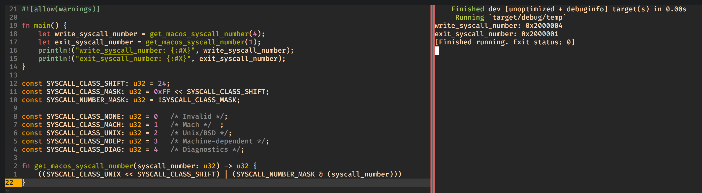
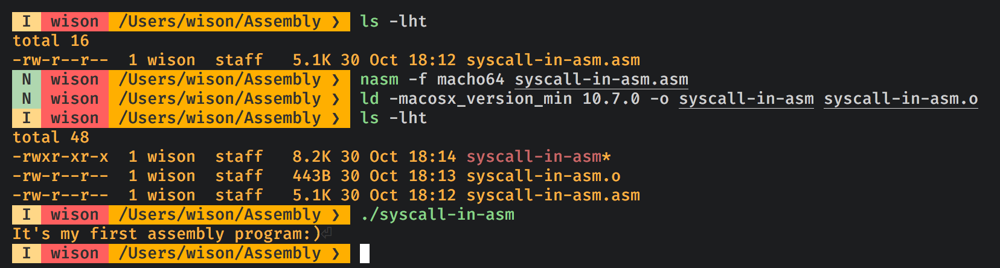

# Demo to show how to write assembly program to call system call in `MacOSX`

### 1. What is system call? 

In computing, a system call (commonly abbreviated to `syscall`) is the programmatic way in 
a computer program requests a service from the kernel of the operating system on which
is executed.

Usually, the program we wrote runs in `User Space`. If the program wants to interact with the 
OS/hardware resource, then we need to fire a `syscall` request and pass it to the `Kernel Space`,
the OS will execute the service we asked for and return the result.

### 2. How to call system call?

For calling the specified system call, we need to follow the steps below:

- Figure out the `syscall` number value from the source code. For example in my MacOSX, the source
file is here: 

    `/Library/Developer/CommandLineTools/SDKs/MacOSX.sdk/usr/include/sys/syscall.h`

    ```
    #define	SYS_exit           1
    #define	SYS_write          4
    ```

    And the `syscall` above is what we want: `write` to standard output and `exit` the current running program.

- For MacOSX, we need to apply the syscall number based on the `system class` which represents at here:

    https://opensource.apple.com/source/xnu/xnu-792.13.8/osfmk/mach/i386/syscall_sw.h

    You can see the macro in the source code like below:

    ```c++
    #define SYSCALL_CONSTRUCT_UNIX(syscall_number) \
                                ((SYSCALL_CLASS_UNIX << SYSCALL_CLASS_SHIFT) | \
                                 (SYSCALL_NUMBER_MASK & (syscall_number)))
    ```

    If we write a simple function in `Rust` to calculate the syscall number, it should look like this:

    ```rust
    const SYSCALL_CLASS_SHIFT: u32 = 24;
    const SYSCALL_CLASS_MASK: u32 = 0xFF << SYSCALL_CLASS_SHIFT;
    const SYSCALL_NUMBER_MASK: u32 = !SYSCALL_CLASS_MASK;

    const SYSCALL_CLASS_NONE: u32 =	0	/* Invalid */;
    const SYSCALL_CLASS_MACH: u32 =	1	/* Mach */	;
    const SYSCALL_CLASS_UNIX: u32 =	2	/* Unix/BSD */;
    const SYSCALL_CLASS_MDEP: u32 =	3	/* Machine-dependent */;
    const SYSCALL_CLASS_DIAG: u32 =	4	/* Diagnostics */;

    fn get_macos_syscall_number(syscall_number: u32) -> u32 {
        ((SYSCALL_CLASS_UNIX << SYSCALL_CLASS_SHIFT) | (SYSCALL_NUMBER_MASK & (syscall_number)))
    }
    ```

    That's why for any syscall number we found in the `sys/syscall.h`, we should add with `0x2000000`.

    So, for the `write` syscall number should be `0x2000004`, and `exit` syscall number should be `0x2000001`.

    Here is the running screen shot:

    

- We need to figure out the syscall function signature by searching in the source code below:

    `/Library/Developer/CommandLineTools/SDKs/MacOSX.sdk/usr/include/unistd.h`

    ```c
    #define	 STDIN_FILENO	0	/* standard input file descriptor */
    #define	STDOUT_FILENO	1	/* standard output file descriptor */
    #define	STDERR_FILENO	2	/* standard error file descriptor */

    ssize_t  write(int __fd, const void * __buf, size_t __nbyte) __DARWIN_ALIAS_C(write);

    void	 _Exit(int) __dead2;
    ```

    As we can see above, `write` syscall takes 2 parameters. So the next question is that: **How do we make the syscall
    in assembly???**

    The answer is that we need to pass syscall number and all parameters into the particular registers, then run the
    `syscall` CPU instruction. The particular registers are below:

    - rax: The syscall number value

    - rdi: used to pass 1st argument to functions
    - rsi: used to pass 2nd argument to functions
    - rdx: used to pass 3rd argument to functions
    - rcx: used to pass 4th argument to functions
    - r8 : used to pass 5th argument to functions
    - r9 : used to pass 6th argument to functions

</br>

Here is the screen shot for compiling and running [`syscall-in-asm.asm`](./syscall-in-asm.asm)



